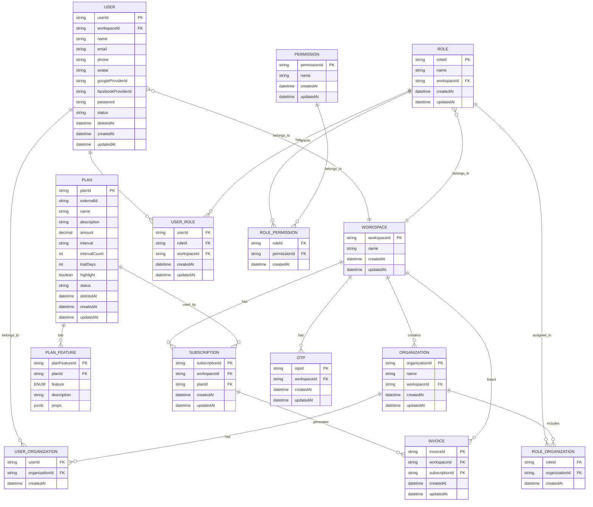

# Starter

# Database ERD

```mermaid
erDiagram
    USER {
      string userId PK
      string workspaceId FK
      string name
      string email
      string phone
      string avatar
      string googleProviderId
      string facebookProviderId
      string password
      string status
      datetime deletedAt
      datetime createdAt
      datetime updatedAt
    }

    WORKSPACE {
      string workspaceId PK
      string name
      datetime createdAt
      datetime updatedAt
    }

    ORGANIZATION {
      string organizationId PK
      string name
      string workspaceId FK
      datetime createdAt
      datetime updatedAt
    }

    ROLE {
      string roleId PK
      string name
      string workspaceId FK
      datetime createdAt
      datetime updatedAt
    }

    PERMISSION {
      string permissionId PK
      string name
      datetime createdAt
      datetime updatedAt
    }

    PLAN {
      string planId PK
      string externalId
      string name
      string description
      decimal amount
      string interval
      int intervalCount
      int trialDays
      boolean highlight
      string status
      datetime deletedAt
      datetime createdAt
      datetime updatedAt
    }

    PLAN_FEATURE {
      string planFeatureId PK
      string planId FK
      ENUM feature
      string description
      jsonb props
    }

    SUBSCRIPTION {
      string subscriptionId PK
      string workspaceId FK
      string planId FK
      datetime createdAt
      datetime updatedAt
    }

    INVOICE {
      string invoiceId PK
      string workspaceId FK
      string subscriptionId FK
      datetime createdAt
      datetime updatedAt
    }

    OTP {
      string otpId PK
      string workspaceId FK
      datetime createdAt
      datetime updatedAt
    }

    %% Pivots
    USER_ROLE {
      string userId FK
      string roleId FK
      string workspaceId FK
      datetime createdAt
      datetime updatedAt
    }

    ROLE_PERMISSION {
      string roleId FK
      string permissionId FK
      datetime createdAt
    }

    ROLE_ORGANIZATION {
      string roleId FK
      string organizationId FK
      datetime createdAt
    }

    USER_ORGANIZATION {
      string userId FK
      string organizationId FK
      datetime createdAt
    }

    %% Relationships
    USER ||--o{ USER_ROLE : has
    ROLE ||--o{ USER_ROLE : has

    ROLE ||--o{ ROLE_PERMISSION : grants
    PERMISSION ||--o{ ROLE_PERMISSION : belongs_to

    ROLE ||--o{ ROLE_ORGANIZATION : assigned_to
    ORGANIZATION ||--o{ ROLE_ORGANIZATION : includes

    USER ||--o{ USER_ORGANIZATION : belongs_to
    ORGANIZATION ||--o{ USER_ORGANIZATION : has

    WORKSPACE ||--o{ ORGANIZATION : contains

    WORKSPACE ||--o{ SUBSCRIPTION : has
    PLAN ||--o{ SUBSCRIPTION : used_by
    SUBSCRIPTION ||--o{ INVOICE : generates
    WORKSPACE ||--o{ INVOICE : linked
    WORKSPACE ||--o{ OTP : has

    PLAN ||--o{ PLAN_FEATURE : has

    USER }o--|| WORKSPACE : belongs_to
    ROLE }o--|| WORKSPACE : belongs_to
```
