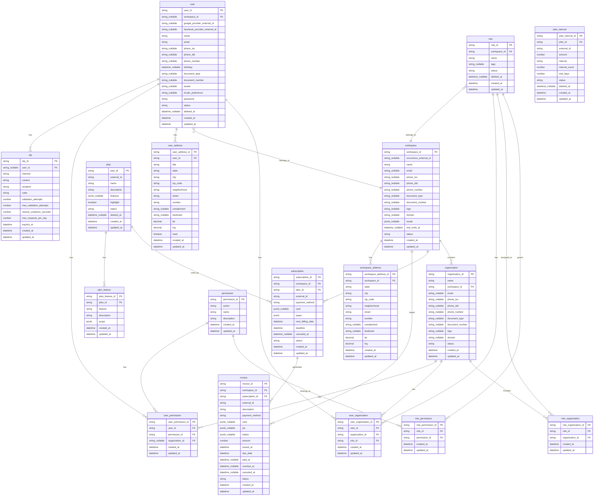

# Starter

# Database ERD

```mermaid
erDiagram
  user {
    string user_id PK
    string_nullable workspace_id FK
    string_nullable google_provider_external_id
    string_nullable facebook_provider_external_id
    string name
    string email
    string_nullable phone_iso
    string_nullable phone_ddi
    string_nullable phone_number
    datetime_nullable birthday
    string_nullable document_type
    string_nullable document_number
    string_nullable avatar
    string_nullable locale_preference
    string password
    string status
    datetime_nullable deleted_at
    datetime created_at
    datetime updated_at
  }

  user_organization {
    string user_organization_id PK
    string user_id FK
    string organization_id FK
    string role_id FK
    datetime created_at
    datetime updated_at
  }

  user_address {
    string user_address_id PK
    string user_id FK
    string title
    string state
    string city
    string zip_code
    string neighborhood
    string street
    string number
    string_nullable complement
    string_nullable landmark
    decimal lat
    decimal lng
    boolean main
    datetime created_at
    datetime updated_at
  }

  user_permission {
    string user_permission_id PK
    string user_id FK
    string permission_id FK
    string_nullable organization_id FK
    datetime created_at
    datetime updated_at
  }

  workspace {
    string workspace_id PK
    string_nullable recurrence_external_id
    string name
    string_nullable email
    string_nullable phone_iso
    string_nullable phone_ddi
    string_nullable phone_number
    string_nullable document_type
    string_nullable document_number
    string_nullable logo
    string_nullable domain
    jsonb_nullable locale
    datetime_nullable trial_ends_at
    string status
    datetime created_at
    datetime updated_at
  }

  workspace_address {
    string workspace_address_id PK
    string workspace_id FK
    string state
    string city
    string zip_code
    string neighborhood
    string street
    string number
    string_nullable complement
    string_nullable landmark
    decimal lat
    decimal lng
    datetime created_at
    datetime updated_at
  }

  organization {
    string organization_id PK
    string name
    string workspace_id FK
    string_nullable email
    string_nullable phone_iso
    string_nullable phone_ddi
    string_nullable phone_number
    string_nullable document_type
    string_nullable document_number
    string_nullable logo
    string_nullable domain
    string status
    datetime created_at
    datetime updated_at
  }

  role {
    string role_id PK
    string workspace_id FK
    string name
    string_nullable tags
    string status
    datetime_nullable deleted_at
    datetime created_at
    datetime updated_at
  }

  role_permission {
    string role_permission_id PK
    string role_id FK
    string permission_id FK
    datetime created_at
    datetime updated_at
  }

  role_organization {
    string role_organization_id PK
    string role_id FK
    string organization_id FK
    datetime created_at
    datetime updated_at
  }

  permission {
    string permission_id PK
    string action
    string name
    string description
    datetime created_at
    datetime updated_at
  }

  plan {
    string plan_id PK
    string external_id
    string name
    string description
    jsonb_nullable features
    boolean highlight
    string status
    datetime_nullable deleted_at
    datetime created_at
    datetime updated_at
  }

  plan_interval {
    string plan_interval_id PK
    string plan_id FK
    string external_id
    number amount
    string interval
    number interval_count
    number trial_days
    string status
    datetime_nullable deleted_at
    datetime created_at
    datetime updated_at
  }

  plan_feature {
    string plan_feature_id PK
    string plan_id FK
    string feature
    string description
    jsonb props
    datetime created_at
    datetime updated_at
  }

  subscription {
    string subscription_id PK
    string workspace_id FK
    string plan_id FK
    string external_id
    string payment_method
    jsonb_nullable card
    jsonb payer
    datetime next_billing_date
    datetime deadline
    datetime_nullable canceled_at
    string status
    datetime created_at
    datetime updated_at
  }

  invoice {
    string invoice_id PK
    string workspace_id FK
    string subscription_id FK
    string external_id
    string description
    string payment_method
    jsonb_nullable card
    jsonb_nullable pix
    jsonb_nullable boleto
    number amount
    datetime issued_at
    datetime due_date
    datetime_nullable paid_at
    datetime_nullable overdue_at
    datetime_nullable canceled_at
    string status
    datetime created_at
    datetime updated_at
  }

  otp {
    string otp_id PK
    string_nullable user_id FK
    string channel
    string context
    string recipient
    string code
    number validation_attempts
    number max_validation_attempts
    number resend_cooldown_seconds
    number max_requests_per_day
    datetime expires_at
    datetime created_at
    datetime updated_at
  }

  role ||--o{ role_permission : grants
  permission ||--o{ role_permission : belongs_to
  role ||--o{ role_organization : assigned_to
  organization ||--o{ role_organization : includes
  user ||--o{ user_organization : has
  organization ||--o{ user_organization : has
  role ||--o{ user_organization : has
  workspace ||--o{ organization : contains
  workspace ||--o{ subscription : has
  plan ||--o{ subscription : used_by
  subscription ||--o{ invoice : generates
  workspace ||--o{ invoice : linked
  plan ||--o{ plan_feature : has
  user }o--|| workspace : belongs_to
  role }o--|| workspace : belongs_to
  workspace ||--o{ workspace_address : has
  user ||--o{ user_address : has
  user ||--o{ user_permission : has
  permission ||--o{ user_permission : has
  organization ||--o{ user_permission : has
  user ||--o{ otp : has
```
